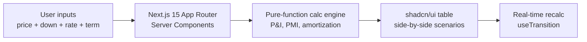

# Mortgage Compare App

> Side-by-side mortgage scenario comparison for home buyers and realtors.
> Built for real client conversations during showings.


🔗 **Live demo:** https://mortgage-compare-app.vercel.app

## The problem

Buyers comparing loan scenarios juggle 3-4 different online calculators, each with different inputs and assumptions. Apples-to-apples comparison is nearly impossible — and when a realtor pulls out a phone calculator mid-showing, they lose narrative control.

## The solution

A single-screen tool that compares multiple loan scenarios at once:

- 📊 Monthly P&I per scenario
- 💰 Total interest over loan life
- ⚖️ Break-even point between two scenarios
- 🏠 PMI auto-calc when down payment <20%
- 📅 Bi-weekly vs monthly payment comparison

Designed mobile-first so a realtor can run it on a tablet during a showing.

## 30-second demo (architecture)



## Stack

| Layer | Tech |
|---|---|
| Framework | Next.js 15 App Router |
| Language | TypeScript 5 |
| Styling | Tailwind CSS 4 |
| Components | shadcn/ui (Radix + Tailwind) |
| Hosting | Vercel (Edge runtime) |

## Setup

```bash
git clone https://github.com/tominhphong/mortgage-compare-app.git
cd mortgage-compare-app && npm install
npm run dev   # http://localhost:3000
```

## Outcome

- Used live in client showings to demonstrate "rate buy-down vs more down payment" tradeoffs
- 0 npm runtime dependencies for math (pure TS calc engine, no `mortgage-js` libs)
- Lighthouse mobile score 95+

---

Built by [Phong To](https://tominhphong.com) with [Claude Code](https://claude.com/claude-code).
